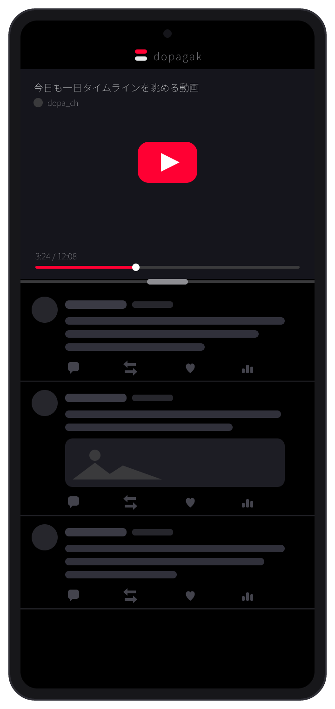
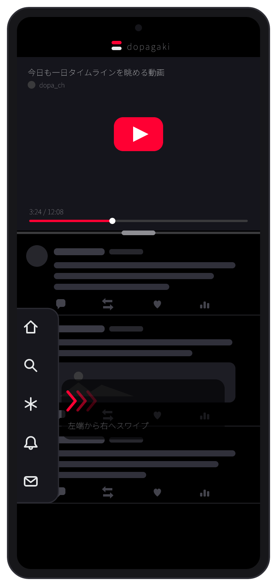
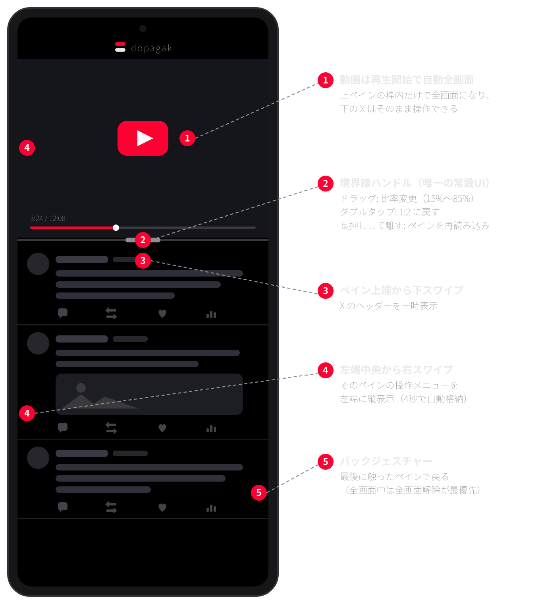

# dopagaki

[](https://github.com/hatake716/dopagaki/actions/workflows/build.yml)

**YouTube を再生しながら、X のタイムラインをひたすらスクロールする**ための Android アプリ。

上 1/3 が YouTube、下 2/3 が X（比率はドラッグで自由に変更）。ステータスバーもナビバーもサイトのメニューも全部消して、画面のほぼ 100% をコンテンツに使う。常設 UI は境界線ハンドル 1 本と最上部の薄いブランドバーだけ。

## 画面イメージ

> 以下は**モックアップ（イメージ画像）**です。実画面では YouTube / X のサイトがそのまま表示されます。

| メイン画面 | 操作メニュー表示 |
|:---:|:---:|
|  |  |
| 上: YouTube / 下: X。境界線をドラッグして比率変更 | 左端から右スワイプで操作メニューが左端に縦表示 |

### 操作ガイド



## 特徴

- **2 ペイン同時動作** — X をスクロールしても YouTube は止まらない。動画を見ながら無限にタイムラインを追える
- **没入優先の画面設計** — イマーシブ表示（ステータスバー・ナビバー非表示）、縦画面固定、使用中は画面が消灯しない
- **ライト / ダーク切り替え** — ブランドバーのタップでアニメーション切り替え。サイト側の表示設定が固定でも、描画テーマを検出して強制的に反転できる
- **統合コントロール** — 各サイトのバーは基本非表示。バックジェスチャーは「最後に触ったペイン」に効き、操作メニューが必要なときだけ左端スワイプで縦型メニューを呼び出す
- **動画は自動でペイン内全画面** — 再生を始めると上ペインの枠いっぱいに全画面化。下の X はそのまま
- **引っ張って更新** — YouTube のホーム / フィード先頭で下に引っ張ると再読み込み（X はサイト標準機能で同様）
- **リンクの自動振り分け** — X 内の YouTube リンクは上ペインで再生、YouTube 内の X リンクは下ペインで開く
- **状態の永続化** — ログイン状態・各ペインの最後の URL・ペイン比率・テーマを保存し、次回起動時に復元
- **X の整理** — 上部バー・下部バー・スペース（音声ルーム）カルーセル・「〜さんがポストしました」の新着通知ピルを非表示にしてタイムラインに集中

## 操作方法

| 操作 | どこで | 動作 |
|---|---|---|
| 上下にドラッグ | 境界線 | 比率変更（上ペイン 15%〜85%、ライブ反映） |
| ダブルタップ | 境界線 | 比率を 1:2 に戻す |
| 長押しして離す | 境界線 | 最後に触ったペインを再読み込み |
| 左端中央から右スワイプ | 各ペイン | そのペインの操作メニューを左端に縦表示（4 秒） |
| 上端から下スワイプ | X ペイン | X のヘッダーを一時表示（4 秒） |
| 先頭で下に引っ張る | YouTube ホーム / フィード | タイムラインを再読み込み |
| タップ | ブランドバー（最上部） | ライト / ダークをアニメーションで切り替え |
| バックジェスチャー | システム | 全画面解除 → 最後に触ったペインで戻る → バックグラウンドへ |
| 動画を再生 | YouTube 視聴ページ | 自動で上ペイン内全画面（バックで解除） |

左端の縦メニューは各ペイン左端の**中央あたり**から。左端の上寄り・下寄りと右端は通常のバックジェスチャーとして働く。

## インストール

[Releases](https://github.com/hatake716/dopagaki/releases) から最新の APK を端末のブラウザでダウンロードしてインストール（サイドロード）。

Google Play での公開は準備中 — 進捗と残作業は [docs/play-release.md](docs/play-release.md) を参照。

## ビルド

```
./gradlew assembleDebug
```

main への push ごとに GitHub Actions が APK / AAB をビルドする。署名用の keystore（Secrets: `KEYSTORE_BASE64` / `KEYSTORE_PASSWORD` / `KEY_ALIAS` / `KEY_PASSWORD`）が設定されているときだけ、署名済みの成果物が Release に添付される。詳細は [SPEC.md](SPEC.md) §7。

## 設計

仕様は [SPEC.md](SPEC.md) が正。Kotlin + View システム + WebView×2 の単一 Activity で、サードパーティ依存なし。サイト側の UI 調整（バー非表示・縦メニュー化・引っ張って更新・テーマ強制反転）は WebView への CSS/JS 注入で行っており、セレクタや挙動は実機の DOM を検査して決めている（SPEC.md §6）。

```
app/src/main/java/io/github/hatake716/dopagaki/
├── MainActivity.kt   # レイアウト・ペイン管理・バック処理・イマーシブ・テーマ
├── PaneWebView.kt    # WebView 共通設定・URL 振り分け・ペイン内全画面・サイト UI 注入
├── DividerView.kt    # 境界線ハンドル（ドラッグ / ダブルタップ / 長押し）
└── Prefs.kt          # 比率・URL・テーマの保存
```

画面イメージや Play ストア用アセットの生成スクリプトは [docs/images/src](docs/images/src) と [docs/play](docs/play) にある。

## プライバシー

アプリ自体はデータを一切収集・送信しない。詳細は [プライバシーポリシー](docs/privacy-policy.md)。

## 既知の制約

- YouTube の Google ログインは WebView 判定で拒否されることがある（UA 調整済みだが、通らない場合は未ログインで使う）
- サイト側の DOM 変更（`data-testid` 等）でバー非表示・縦メニューなどの表示調整が効かなくなることがある。その場合も表示自体は壊れない
- テーマの強制反転はサイト自身のテーマ設定を書き換えるものではないため、配色はサイトネイティブのテーマと完全には一致しない
- アプリを裏に回すと YouTube の再生は止まる（サイトの仕様）。PiP 化は将来検討

詳細は [SPEC.md](SPEC.md) §9。
